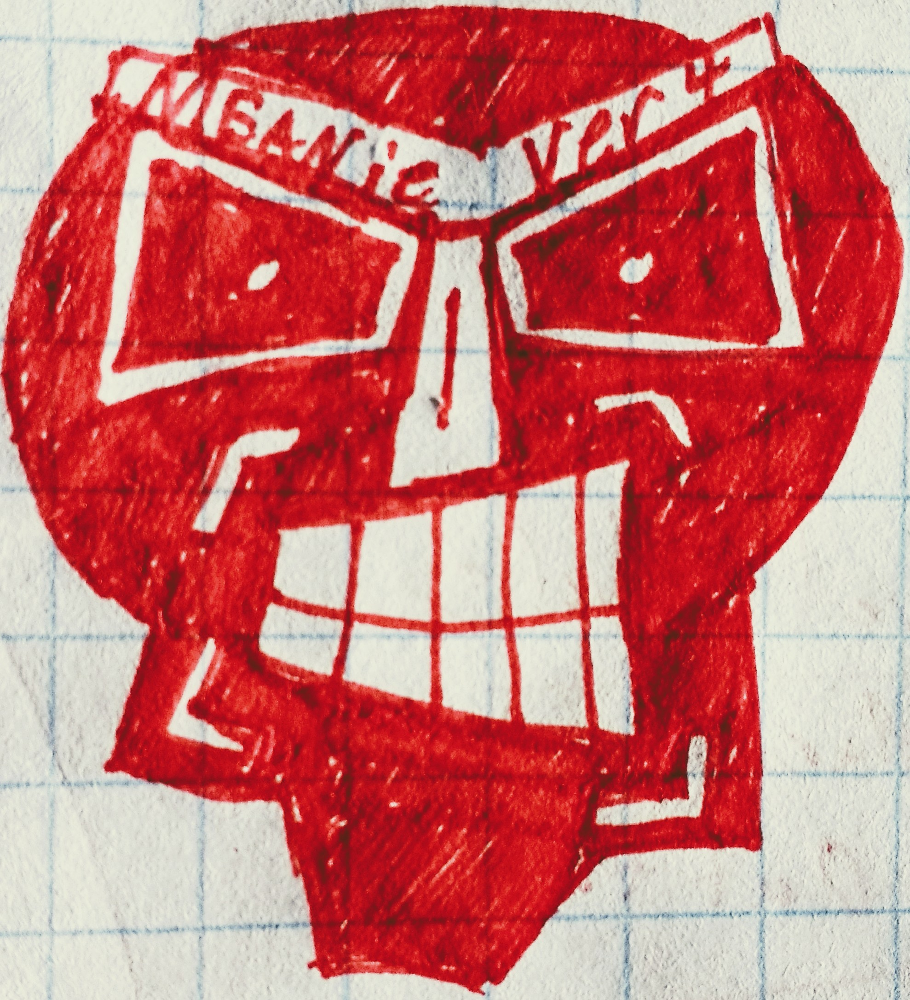
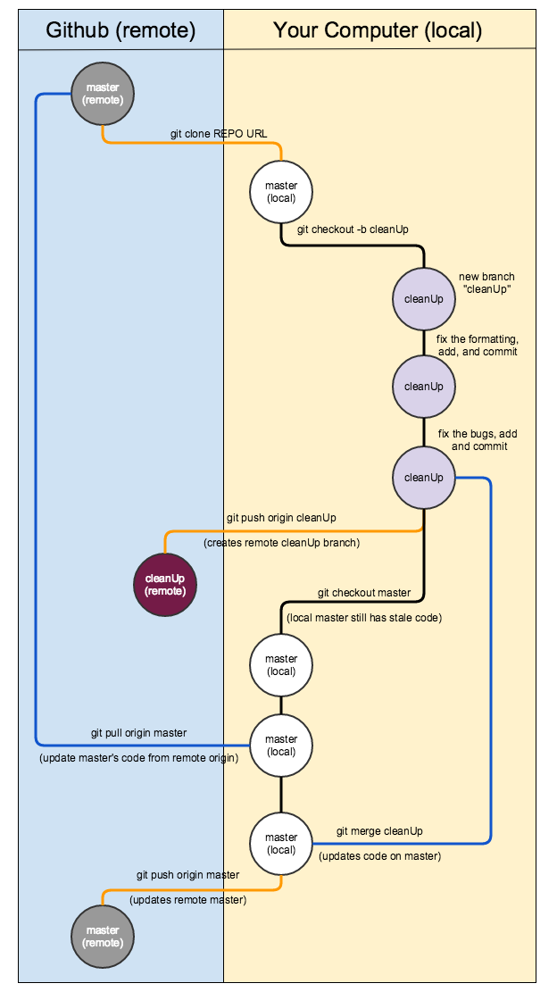

MEANie ver 4.0
===



Project Overview
================

MEANie is a project that *mostly* working, but has some problems:

Problems:
* difficult to read formatting
* there are some bugs that keep it from working right now

Once the problems have been addressed, the client wants additional functionality:

* show data on the DOM, not just in the console
* if time allows: add ability to delete records from the db

You can think of this assignment in two tiers:

1 - clean up the formatting and the bugs

2 - add functionality as requested from the client

Your final project should have a 'master' branch that is the final project. As well branches for each stage of the work. This is outlined below

This is a 'peer' activity, but feel free to talk/work with your pod-mates and cohort-mates.

Your github project should have the following branches:
* 'master' (final assignment)
* 'cleanUp' (fixed formatting and bugs fixed)
* DomDisplay
* 'delete' (added delete)

Branching overview/workflow:
============================

the 'cleanUp' branch
------------------
Once you've cloned the repo create a new branch named 'cleanUp':

```
git checkout -b 'cleanup'
```

This will create a new branch called 'cleanUp' and move you over to this new branch.

Now that you are on this branch go ahead and fix the formatting and bugs in the code. Commit regularly. I suggest that you first fix the formatting and then commit once the code is more readable. Next, ID and fix the bugs and commit again.

push cleanUp branch to github
-----------------------------
Once everything is working make a final commit on this branch. We now want to push this to github. Do this by running this git command:

```
git push origin cleanUp
```

This will create a new branch on github named "cleanUp" and push the stuff from your local "cleanUp" branch to github. However, our master branch is still full of stale code.

merging cleanUp into master and updating remote master
------------------------------------------------------
Let's update master:

```
git checkout master
```

In case any group members have made updates to Master we'll pull from the origin master before merging our code into local master.

```
git pull origin master
```

This will update your local master branch with what's on github, but we still need to merge in our updates from 'cleanUp' to make it current.

```
git merge cleanUp
```
Your local master branch should now be up to speed. Let's also push that to github:

```
git push origin master
```

visual representation of what we just did
-----------------------------------------


DOM Append
----------
(if time allows)

At this point both your branches are up to date both locally and on github. Let's break off a new branch for showing the info on the DOM:

```
git checkout -b DomDisplay
```

Now take a stab at adding the DOM Append functionality. Commit often. When done, repeat the git steps to push the 'DomDisplay' branch to github, merge it's updated code into the master branch, and push the updated master to github.

If time allows, take a stab at adding a button to delete records. Keep the formatting clean and use branches.

glhf
